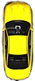

### Overall project concept and description
I created driving game in which the player controls a car on the screen using physical steering wheel (direction) and pedals (speed). The player can collect things such as gas, coins, and extra lives during the drive and meanwhile should avoid bumping into another car, hit the curb, or running out of gas in order to keep the game going.

