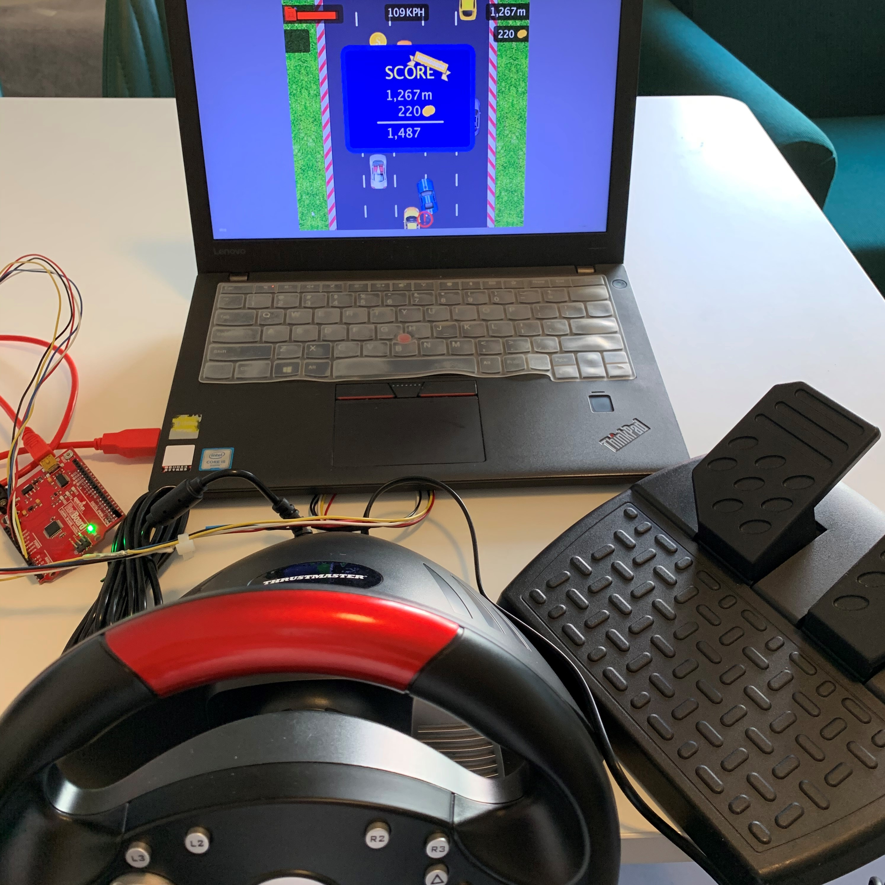
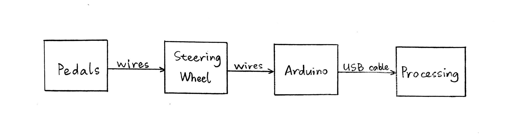
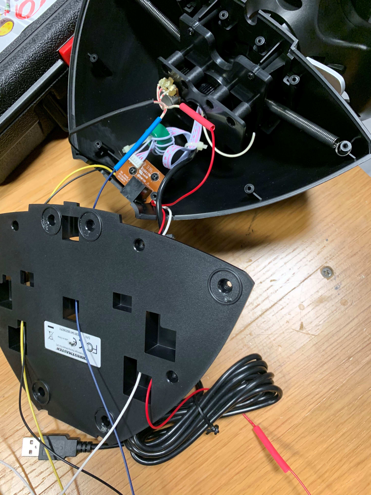

### Overall project concept and description
I created a driving game in which the player selects a car on the screen and controls the car using physical steering wheel and pedals. The player can collect elements such as gas, coins, and extra lives in the game and meanwhile should avoid bumping into another car, hit the curb, or running out of gas in order to keep the game going. After the game, his/her score is calculated and a scoreboard is presented. The player (or another player) can restart the game and keep playing.
### Overall picture
The pedals (right) are connected to the steering wheel; the steering wheel (middle) is connected to Arduino; Arduino (left) is connected to the laptop.

### System diagram

### List of important parts
Pedals, steering wheel, Arduino, and laptop.
### Pictures of the steering wheel

### Code
[Processing](Final_Processing/Final_Processing.pde)
[Arduino](Final_Arduino/Final_Arduino.ino)
### How my project works and how I built it
